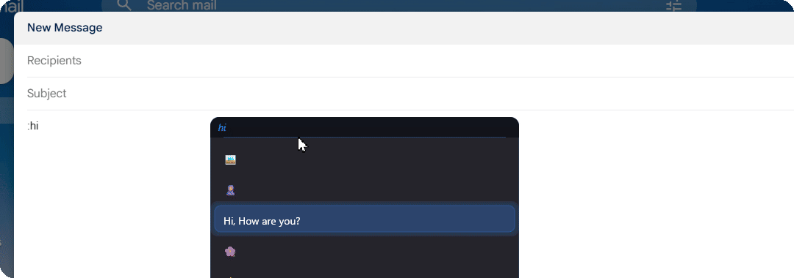

<picture>
  <source media="(prefers-color-scheme: dark)" srcset="https://readme-typing-svg.demolab.com?font=Fira+Code&pause=1200&color=F8FAFC&center=true&vCenter=true&width=650&lines=I+build+tools+that+fix+annoyances;Desktop+apps+%26+backend+APIs;Python+%C2%B7+C%2B%2B+%C2%B7+AI+Evaluation" />
  
</picture>

&nbsp;&nbsp;

---

## About

I'm a **Backend & Systems Engineer** in Dhaka, Bangladesh. I build software by starting from a small, real annoyance and asking how to make it disappear, and I like the result to be fast, light and simple enough that nobody needs a manual.

- **EX-Expander** replaces the habit of memorizing shortcuts. Start typing and a popup suggests your expansions, so you pick one with the arrow keys. It works in any app, never steals focus, and ships as a ~3 MB native download.
- **LingoLens** removes the copy, switch-tab, paste routine of translating on-screen text. Snip any region and the translation appears in place, right where the original was.

I also bring an AI-evaluation background (5,500+ LLM evaluation and annotation tasks across RLHF, tool-calling and multilingual projects), so I know how models fail and how to test them.

Open to backend, systems and AI evaluation roles.

---

## Featured Projects

### [EX-Expander](https://github.com/srnafi/EX-Expander) &nbsp; 

**A system-wide text expander for Windows.** Type a shortcode in any app, pick from the popup, and the expansion is inserted without stealing focus. No need to memorize your own shortcuts.

- **~3 MB** native download, **~3% CPU** while in active use
- Low-level keyboard hooks: works in browsers, editors and games
- GPU-rendered popups (Direct2D) that never steal focus
- Per-app scoping, custom trigger characters, auto-start on login
- Clipboard-safe insertion and a built-in WebView2 expansion manager for adding and editing expansions

    

  
   Type :hi → pick → inserted anywhere

### [LingoLens](https://github.com/srnafi/LingoLens)

**OCR screen translator.** Press <kbd>Alt+Shift+M</kbd>, drag a box over any on-screen text — the translation renders in place over the original.

- Persistent **Flask + EasyOCR** backend loads models once, so snips are instant (20+ languages)
- **55% faster OCR** through optimized image preprocessing
- Tiered translation fallback (Google → deep-translator → MyMemory) so a snip never fails
- Dark PyQt5 control center for languages, colors, opacity and fonts

     

---

## What I reach for

<picture>
  <source media="(prefers-color-scheme: dark)" srcset="https://github-readme-stats.vercel.app/api/top-langs/?username=srnafi&layout=compact&theme=github_dark&hide_border=true&card_width=450" />
  
</picture>

---

## Tech Stack

| | |
|---|---|
| **Languages** | Python · C++ · JavaScript / TypeScript · Java · C · Shell · Lua |
| **Backend** | Node.js · Express · Flask · FastAPI · REST APIs · JWT / RBAC |
| **Databases** | MongoDB · PostgreSQL · SQLite |
| **Systems & Desktop** | Win32 API · Direct2D · WebView2 · PyQt5 · Electron |
| **Vision / ML tooling** | OpenCV · EasyOCR · OpenVINO |
| **Tools & Frontend** | Git · Docker · Linux · React |

     

---

## AI Evaluation Background

- **RWS TrainAI**: 5,000+ multilingual evaluation and annotation tasks (Jan 2025 – Aug 2026)
- **Outlier (Scale AI)**: 400+ assignments in LLM evaluation, adversarial prompting, RLHF and tool-calling, plus reviewing other contributors' work (Oct 2024 – Feb 2026)
- Completed RWS Linguistic AI certification training (machine translation, NMT, LLMs, MT evaluation)

